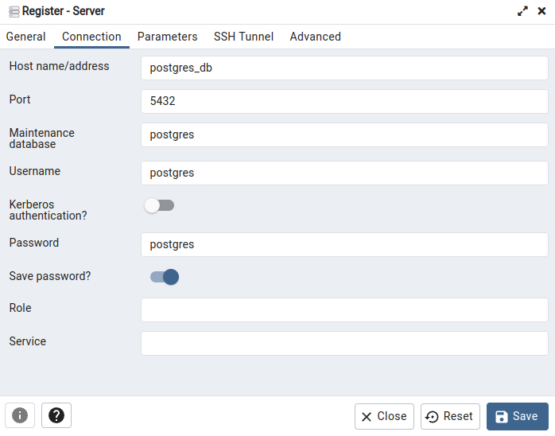

# NestJS Playground

<div align="center">
  <a href="http://nestjs.com/" target="blank"></a>
</div>

<div align="center">
A progressive <a href="http://nodejs.org" target="_blank">Node.js</a> framework for building efficient and scalable server-side applications.
</div>

<div align="center">
  <a href="http://nestjs.com/" target="_blank" rel="noreferrer">
    
  </a>
  <a href="https://www.postgresql.org/" target="_blank" rel="noreferrer">
    
  </a>
  <a href="https://www.pgadmin.org/" target="_blank" rel="noreferrer">
    
  </a>
  <a href="https://www.postman.com/" target="_blank" rel="noreferrer">
    
  </a>
  <br />
  <a href="https://www.typescriptlang.org/" target="_blank" rel="noreferrer">
    
  </a>
  <a href="https://eslint.org/" target="_blank" rel="noreferrer">
    
  </a>
  <a href="https://prettier.io/" target="_blank" rel="noreferrer">
    
  </a>
  <br />
  <a href="https://www.docker.com/" target="_blank" rel="noreferrer">
    
  </a>
  <a href="https://yarnpkg.com/" target="_blank" rel="noreferrer">
    
  </a>
  <a href="https://git-scm.com/" target="_blank" rel="noreferrer">
    
  </a>
</div>

## Description

[Nest](https://github.com/nestjs/nest) framework TypeScript starter repository. \
This repository is the result of this [Udemy course (NestJS Zero to Hero)](https://www.udemy.com/course/nestjs-zero-to-hero/)

## Installation

This repo uses a Makefile with docker-compose.

```bash
$ make
```

You can find my Postman Collection [here](assets/postman_collection.json).

## Running the app

```bash
# development
$ yarn run start

# watch mode
$ yarn run start:dev

# production mode
$ yarn run start:prod
```

## Test

```bash
# unit tests
$ yarn run test

# e2e tests
$ yarn run test:e2e

# test coverage
$ yarn run test:cov
```

## Setup pgadmin

Register to a new server:
- Hostname: `postgres_db`
- Port: `5432`
- Username: `postgres`
- Password: `postgres`

<div align="center">
  
</div>

## Todo

- [ ] Add Swagger
- [ ] Add Unit Testing
